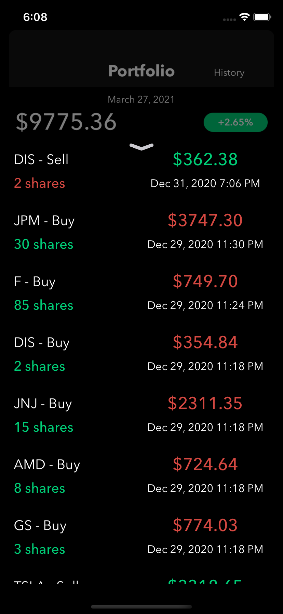

# Equiteez
A simple iOS application to buy & sell stocks and view the financial statements of publicly traded companies.

## Screenshots
  

&nbsp;&nbsp;&nbsp;Watchlist&nbsp;&nbsp;&nbsp;&nbsp;&nbsp;&nbsp;&nbsp;&nbsp;&nbsp;&nbsp;&nbsp;&nbsp;Portfolio View&nbsp;&nbsp;&nbsp;&nbsp;&nbsp;&nbsp;&nbsp;&nbsp;&nbsp;&nbsp;&nbsp;&nbsp;Trade History

## Dependencies
- Charts: https://github.com/danielgindi/Charts
- SPStorkController: https://github.com/ivanvorobei/SPStorkController
- SwiftDataTables: https://github.com/pavankataria/SwiftDataTables
- FaveButton: https://github.com/xhamr/fave-button
- SearchTextField: https://github.com/apasccon/SearchTextField
- DropDown: https://github.com/AssistoLab/DropDown
- Alamofire: https://github.com/Alamofire/Alamofire
- SwiftyJSON: https://github.com/SwiftyJSON/SwiftyJSON

BIG thanks to FinancialModelingPrep! Their API supplied the data feverything in this project. Check it out at https://financialmodelingprep.com/developer/docs
