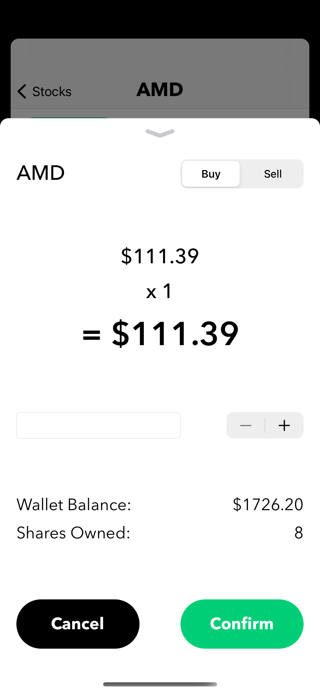

# Equiteez
A simple iOS application to buy/sell stocks using virtual $$$ and view the financial statements of publicly traded companies. This app stores transactions made & other information 100% on-device using CoreData.

## Screenshots
    

&emsp;&emsp;&emsp;&emsp;Watchlist&emsp;&emsp;&emsp;&emsp;&emsp;&emsp;&emsp;Stock News&emsp;&emsp;&emsp;&emsp;&emsp;&emsp;&emsp;Trade Screen&emsp;&emsp;&emsp;&emsp;&emsp;&emsp;Portfolio View

## Dependencies
- Charts: https://github.com/danielgindi/Charts
- SPStorkController: https://github.com/ivanvorobei/SPStorkController
- SwiftDataTables: https://github.com/pavankataria/SwiftDataTables
- FaveButton: https://github.com/xhamr/fave-button
- SearchTextField: https://github.com/apasccon/SearchTextField
- DropDown: https://github.com/AssistoLab/DropDown
- Alamofire: https://github.com/Alamofire/Alamofire
- SwiftyJSON: https://github.com/SwiftyJSON/SwiftyJSON

BIG thanks to FinancialModelingPrep! Their API supplied the data for this project. Check them out at https://financialmodelingprep.com/developer/docs.
